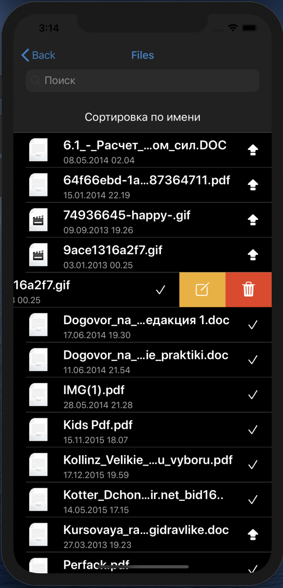
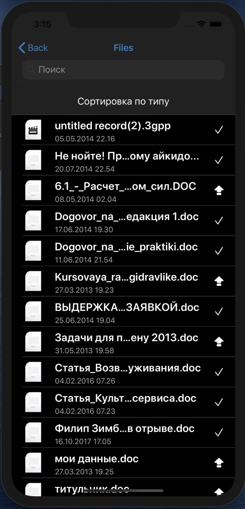
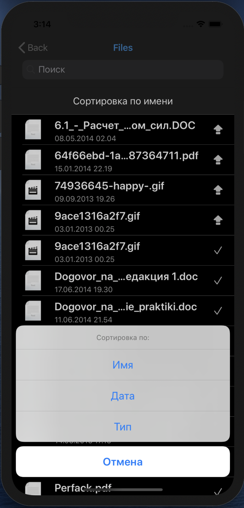

# FileManagerVK
Файловый менеджер VK 🗄

## Базовые возможности
* Возможность авторизоваться в ВК
* Отображение списка файлов пользователя
* Выполнение стандартных действий над файлами: удалить/переименовать
* Открытие документов через другие приложения

## Advanced Фичи
* Открытие каких-нибудь форматов файлов внутри приложения
* Локализовано на 2 языка en и ru
* Реализовано 2 темы darck и light, выбор соответствует системной теме

## API для приложения

[Документация VK](https://vk.com/dev.php?method=docs)

## Паттерны
- Архитектура: MVC 
- Навигация реализована через: Coordinator
- Создание экранов через: Factory
- Зависимости вынесены в  DI

## Предупреждение
Удаление файлов ведет к удалению их с вашего аккаунта в соц сети. 

## Diagram Application: 
[Diagram](https://viewer.diagrams.net/?highlight=0000ff&edit=_blank&layers=1&nav=1&title=AppDiagram.drawio#R5Vtbc%2BI2FP41PNKxLF%2FgkYVssjPZzraUTbYvHS1WbLXG8ggRIL%2B%2BNpYwtlLwkiVHSZ%2BwjmVb%2Bs7Rdy4SPTxebK4FyZPPPKJpz3WiTQ9Peq6LAuwXP6VkW0nCwK0EsWCR6lQLpuyJKqGjpCsW0WWjo%2BQ8lSxvCuc8y%2BhcNmRECL5udnvgafOrOYmpIZjOSWpK71gkk0o6cMNafkNZnOgvo2BY3VkQ3VnNZJmQiK8PRPiqh8eCc1ldLTZjmpbgaVyq5z7%2Bx939wATNZJcHOGNo0d%2FMokXw5%2B1k9hQ78r7vqbHJrZ4wjYr5qyYXMuExz0h6VUs%2FCL7KIlq%2B1SladZ9bzvNCiArh31TKrVImWUleiBK5SNVdc%2BRqMku%2BEnM1jg90zGX%2F5jefP3yZrEfX7l%2F3i762ACJiKo9MC1f9yrkcfEDhck35gkqxLToImhLJHpu6Jspk4n2%2FGtXiQgH7AyD77xNk1yqQQwiQC2zF9r58%2FhdfN7%2Bp1%2B0ak02jtVWtyysngFLOsVE%2FknSlvjTK8wlNaUwkNRTXVMs6YZJOc7KDZV14mY52%2FkiFpJujk1d3saZo5aOQbq9rxt%2FLkgO2D5wLGbNr4DX7dMey0n9Ag%2BVbBxY2wJp8AocJWQeTjqjeEUMeY76TDDmwyn0hBKGdy6M8tArl4Dk%2FlLJ58WmejTkXEcuI5AKcPtouyfWg6QMHIPSxYbJij9BXzW8Ht2ryKBsv545BR6v2fKvM2oOmdveHuL1WqvsaStXKOp012kVWnvs%2FWHGdleOhn62c3aMjIcj2oEPOWSaXB2%2F%2BUgpqYg5xk5jDdtWl3X9wtH9xUY2gNpP9VM63nIHh5j6ylN6ypbTJx7UzCRxA%2Bzhkb6XmWHB1cu0gu0o1CCSUeAWY7So7IpCS2CvA7FkF89Ag22kxBauYtl2MgGdaFya2ObMYsY%2BJDgIi9YoLhESarU8X4H96SPQynb4xWu%2BOs13Znh73IePkKVkmX8fgTNNvhbveAJxpQLY43wjT4K4rwK7Ixh2C6hQ1NFor2I5yhw6PAGjtrIwa%2B03KCAbHM2oUvKz%2FEL9CBo6BazdWGRq2o3SDj5dijP5uAFC6QeZu5mglkyKLYE%2B7XQoLnHw7nYB38toUD1C7o99L4CyAq72XAw%2FXfg5GBMko%2FAmDvuu0GN4BB%2BzkqrQBOM862AYQXvB8j%2BZ23YzQxz9tiYd9cz3T5bKwy1Geg5tlOyccwttlaOA1W1IxoQ9klVYhhFWIIQe8YIdNl1EyYEmA8Af42g4D3sLw%2BzuO%2Bvw8u1YQsF01NAzimXR%2Bpq%2Br%2BkF4vLxjs1Lt2onBZpSm972tiM%2F2%2FxqxJkDDZt5UIvYH%2BZ7SErLqHcCwDb0WbOD5EzbjrR1kN5REVFhhawg51qH2zE5pQaKfSUZiKsARax9HgQ8ivDe1dXG%2Bv9FHu06fAbNrG8IzY%2BJfqVxz8Q%2FL4ikVj2wOHxuH9pm16aZnv9%2BqhNU6vJADD9gb21jvfuDWsvVsuvV9%2FAhfRg5a5b1LlpGLZv3H5Gpro%2F57N776Fw%3D%3D)

### Примеры экранов:

  
